<div align="center">
<picture>
  <source media="(prefers-color-scheme: dark)" srcset=".github/brand/banner-night.svg">
  
</picture>
<br><br>
<a href="#about"><picture><source media="(prefers-color-scheme: dark)" srcset=".github/brand/tab-about-night.svg"></picture></a>
<a href="#status"><picture><source media="(prefers-color-scheme: dark)" srcset=".github/brand/tab-status-night.svg"></picture></a>
<a href="#quickstart"><picture><source media="(prefers-color-scheme: dark)" srcset=".github/brand/tab-quickstart-night.svg"></picture></a>
</div>

<p>
<a name="about"></a>
<picture><source media="(prefers-color-scheme: dark)" srcset=".github/brand/section-about-night.svg"></picture>
</p>

Setka ("network" in Russian, internally still module-named `netviz`) captures live TCP/UDP traffic on an interface, aggregates it into flows, and streams them to a browser over WebSocket in real time. Unlike the other early-stage tools in this account, the full pipeline actually runs end-to-end today.

<p>
<a name="status"></a>
<picture><source media="(prefers-color-scheme: dark)" srcset=".github/brand/section-status-night.svg"></picture>
</p>

| Stage | Today | Planned |
|-------|-------|---------|
| **Capture** (`internal/capture`) | ✅ Real libpcap capture, BPF-filtered to TCP/UDP | — |
| **Enrich** (`internal/enricher`) | ⚠️ Direction detection is real; process-name attribution is a hardcoded port lookup (e.g. `443 → "browser"`) | Real process lookup via OS APIs |
| **Process** (`internal/processor`) | ✅ Real flow aggregation, idle-flow cleanup every 60s | — |
| **API** (`internal/api`) | ✅ Real WebSocket broadcast to connected browser clients | REST endpoints alongside the socket |
| **Web UI** | ✅ Minimal static page | DNS reverse resolution, GeoIP, D3.js flow graph |

<p>
<a name="quickstart"></a>
<picture><source media="(prefers-color-scheme: dark)" srcset=".github/brand/section-quickstart-night.svg"></picture>
</p>

```sh
# macOS: brew install libpcap   ·   Linux: sudo apt-get install libpcap-dev
git clone https://github.com/NoamFav/Setka && cd Setka
go mod download

sudo go run cmd/netviz/main.go        # requires root for packet capture
sudo go run cmd/netviz/main.go -i en0 # or target a specific interface

# then open http://localhost:8080
```

> [!TIP]
> Run `curl google.com` in another terminal while the server is up — the flow should appear in the web UI within a second.

<div align="center">

Made with ♥ by [NoamFav](https://github.com/NoamFav)

</div>

<br>

<a href="https://nf-software.com">
<picture>
  <source media="(prefers-color-scheme: dark)" srcset=".github/brand/footer-night.svg">
  
</picture>
</a>
